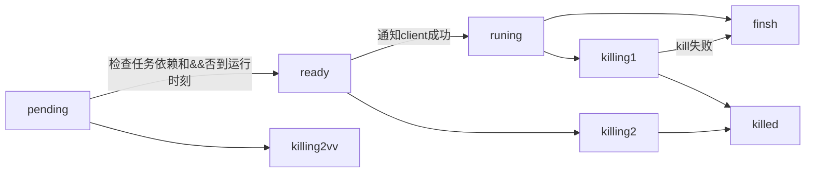

## Perputeal

---

# 设计目标
1. 支持多用户组、用户
2. 任务规模及任务调度低延迟（1ms）
3. 支持简单协议自定义客户端（客户端可以部署在任意机器）
4. 任务可以指定进入不同的客户端
5. 系统不关注的内容
    1. 用户和用户组的创建
    2. 用户访问权限控制
    3. 系统只关注任务和任务运行本身
# 核心模块
### 任务状态迁移

### 外部接口
 1. task创建
    1. 输入：{}
    2. 输出：
 2. task更新
    1. 输入：{id:***,}
    2. 输出：
 4. task删除
 5. 创建task实例(启动)
    1. 输入： {taskid: , starttime, endtime}
 6. 杀死task实例
 7. task运行记录
 8. task查询
### 通知协议
 1. 输出
    1. 启动实例（同步变成run)
    2. 杀死实例 (同步变成killing)
 2. 状态回调
    1. 任务失败
    2. 任务完成
    3. 任务杀死
### 任务发生器
#### 设计考虑问题
 1. uid 1-1kw  为vip用户，普通用户 id大于1kw
 2. 启动参数： 支持任务hash： 1:255   支持用户段：用户id-用户id段
 3. 任务能直接调度在多个里面都可以进行发生 ，  关联日期+taskid 
 4. 保证自动调度不会重复添加任务实例（字段添加下次运行时间（修改和新建的这个字段会为空））
 #### 实现方案
 每分钟会过滤（小于关联时间）任务定义表，产生任务实例，创建任务实例，并更新下次运行时间。

### 任务调度器  
1. 任务包含uid
2. 输入 任务hash  1：255 用户id：用户id  一个调度器一个队列
3. 查询taskinstance表，大于某个id，任务是阻塞状态的任务实例 直接添加到 调度队列。 
4. 任务失败或重跑任务原来的实例数据删除
5. 队列Pop 出来后检查依赖，延迟  没问题发送出去（通知模块）  
6. 有问题放到队列里面（优先级-retry）。

### 任务通知模块
1. 调度器到任务通知模块 xmlrpc。
2. 任务到worker xmlrpc
3. 通知worker协议：
    1. create
    2. kill
4. worker回调协议：
    1. scuccess
    2. fail
### 内部状态处理模块

### 目前处理和问题
1. 任务创建和任务实例的生成放在一个模块里面
    1. 优点：
        1. 创建能直接添加到任务实例的生成。
        2. 单一进程能够比较好的控制和更新任务，效率高。
        3. 如果任务创建的比较多，添加节点可以直接平衡。
    2. 缺点：
        1. 任务无法控制在某个节点进行生成，迁移任务必须在某个节点进行一次更新。
        2. 如果对某些任务高优先级支持不好： 只能在最开始让他们的创建在新的节点。
        3. 单个节点如果任务积累的多，不好进行拆分。
2. 现在创建任务队列对应的是一个进程一个，新创建的任务直接在某个队列。
如果是更新调用了其他的进程来处理。这个时候就有两个任务发生器在对同一个任务进行进行操作。这时候怎么处理？

    队列是共享的，多个进程可以从队列里面强到对应的任务。
